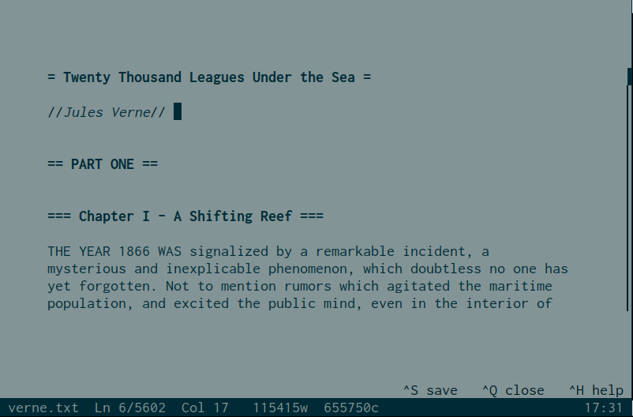
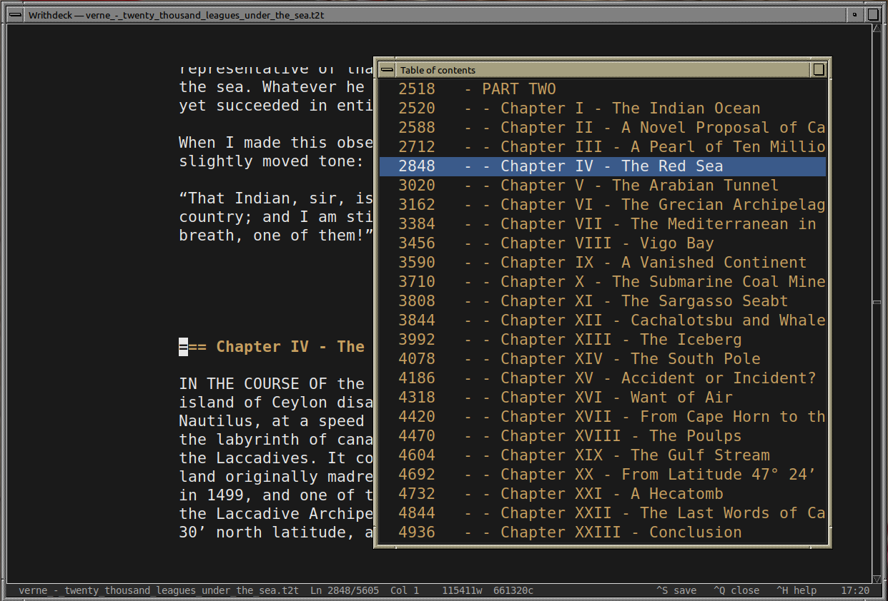

 
# WrithDeck 


WrithDeck is a distraction-free text editor designed for writers using a dedicated writerdeck, whether it's a DIY prototype or a computer configured specifically for that purpose. It's fast and easy to customize. WrithDeck can run as a clean graphical application or directly in a terminal or TTY, all from a single file with no installation required.

It includes customizable inline syntax highlighting, a file browser, split view, chapter navigation through a table of contents, and a fully themeable interface, all in under 3,900 lines (170 Kb) of Tcl/Tk.

Whether you're writing on a Raspberry Pi Zero with an E-ink screen, on a an android tablet, over SSH, or on your desktop, WrithDeck stays lightweight and lets you focus on your text.

It has GUI and TUI dual mode with similar behaviors, and is fully configurable.



## Usage

You will need to have Tcl/Tk on your system. On Debian-based OS, just 

``apt install tk``

On Windows you can get binaries for the Tcl runtime there: https://www.tcl-lang.org/software/tcltk/bindist.html

On Haiku OS, Tcl/Tk is available via HaikuPorts (`pkgman install tcl tk`). GUI and TUI modes both work.

Then:

```
wish writhdeck.tcl                     # GUI, file browser
wish writhdeck.tcl file.txt            # GUI, open file directly
tclsh writhdeck.tcl --no-gui           # TUI, file browser
tclsh writhdeck.tcl --no-gui file.txt  # TUI, open file directly
```

you can also run it from the terminal with ./writhdeck.tcl or, better, copy it into your path (into /usr/local/bin/ for example) for a direct access.


## Command-line options

| Option | Description |
|---|---|
| `--help`, `-h` | Show help and exit |
| `--gui` | Force GUI (Tk) mode — skip display socket detection |
| `--no-gui` | Force TUI (terminal) mode |
| `--tui`, `--ng` | Aliases for `--no-gui` |

When both `--gui` and `--no-gui` are given, `--no-gui` takes precedence.


## Features

- Plain `.txt` file editor focused on distraction-free writing
- Documents stored in `~/Documents/writhdeck/` (auto-created)
- File browser: files sorted by modification date, open / create / rename / delete / scratchpad
- Word-wrapped display with configurable margins
- **Inline syntax highlighting** (GUI and TUI):
  - Headings: configurable marker (`= title =`) and Markdown (`# title`)
  - Comments: lines starting with `%` (configurable `comment_marker`)
  - Bold `**text**`, italic `//text//`, underline `__text__`, strikethrough `--text--` — all markers configurable
  - Marker characters greyed out; styled text in a configurable `color_markup`
- Table of contents overlay: jump to any heading (last selection remembered per session)
- Status bar: fully configurable zones (left / center / right) with tokens: `filename dirty sel ln col words chars clock help_bar space`
- Go to line
- UTF-8 input support
- Cursor position restored across sessions (`.cursors.json`)
- Configuration reloaded on each new document open (no restart needed)
- Dark/light theme toggle (`Ctrl+D` by default, configurable)
- Interface language: `lang = en` or `fr`
- **Unified browser behavior**: after closing a file, both GUI and TUI return to the file browser (configurable via `browser`)
- **Scratchpad**: temporary in-memory buffer, no disk file until explicitly saved
- **Help dialog**: shows selection word/char count when text is selected (GUI and TUI)




---

## Configuration

`~/Documents/writhdeck/writhdeck.ini` — sections: `[editor]`, `[behaviour]`, `[keys]`, `[colors]`

All keyboard shortcuts are configurable via the `[keys]` section.

### Key INI options

**`[editor]`**

| Key | Default | Description |
|---|---|---|
| `heading_marker` | `=` | Heading delimiter (`= title =`) |
| `comment_marker` | `%` | Line comment prefix; set to `0` or leave empty to disable |
| `bold_marker` | `**` | Bold inline marker; set to `0` or leave empty to disable |
| `italic_marker` | `//` | Italic inline marker; set to `0` or leave empty to disable |
| `underline_marker` | `__` | Underline inline marker; set to `0` or leave empty to disable |
| `strikethrough_marker` | `--` | Strikethrough inline marker; set to `0` or leave empty to disable |
| `margin_width` | `60` | Horizontal padding (px, GUI) |
| `margin_cols` | `6` | Horizontal margin (cols, TUI) |
| `font_size` | `13` | Font size (GUI) |
| `font_family` | `Mono` | Font family (GUI); Tk resolves `Mono` to the best available monospace per OS — override with e.g. `JetBrains Mono`, `Consolas`, `Fira Code` |
| `line_spacing` | `100` | Line spacing in % (GUI) |

**`[behaviour]`**

| Key | Default | Description |
|---|---|---|
| `browser` | `1` | Return to file browser after closing a file |
| `watch_file` | `1` | Detect external file modifications and prompt to reload; `0` to disable |
| `split_shrink_margin` | `1` | Halve `margin_width` in split view (GUI); `0` to keep the full margin |
| `hemingway_mode` | `0` | When typewriter mode is active: block arrows, backspace and undo; hide status bar; double margins |
| `console_center_alert` | `1` | Center confirm dialogs (TUI); `0` = bottom bar |
| `block_cursor_gui` | `1` | Block cursor in GUI mode |
| `block_cursor_console` | `1` | Block cursor in TUI mode |
| `blink_cursor` | `0` | Blinking cursor |
| `line_numbers` | `0` | Show line numbers |
| `cursor_restore` | `1` | Restore cursor position on reopen |
| `lang` | `en` | Interface language (`en` or `fr`) |
| `dark_mode` | `1` | Dark theme; `0` = light (Solarized-style) |
 
**`[keys]`** — all actions are rebindable: `key_save`, `key_close`, `key_find`, `key_replace`, `key_goto`, `key_open`, `key_undo`, `key_redo`, `key_help`, `key_toc`, `key_line_numbers`, `key_fullscreen`, `key_split`, `key_split_focus`, `key_typewriter`, `key_dark_toggle`. Use Tk key names (`Control-s`, `Alt-Return`, `F11`, etc.).

**`[colors]`** — `color_heading`, `color_comment`, `color_markup`, `color_bg`, `color_fg`, `color_bg_bar`, `color_fg_bar`, `color_bg_sel` + `_alt` variants for light mode.


---

## GUI mode 

It is the default, and requires Tk

**Display**
- Graphical window with scrollable editor and file browser
- Configurable pixel margins, font size, font family, line spacing, colors (via INI)
- Inline syntax highlighting: headings, comments, bold, italic, underline, strikethrough
- Line numbers: synchronized with scroll (`line_numbers = 1`)
- Dynamic font resize: Ctrl++ / Ctrl+-  (keyboard and numpad)
- Fullscreen toggle (default: Alt+Enter, configurable)
- Built-in Solarized Light theme (toggle with `dark_mode` or `Ctrl+D`)
- Optional second docs folder (`docs_dir`), shown as two labeled sections in the browser
- Clock (HH:MM) in status bar: add `clock` token to a status zone
- Block cursor: rectangle with inverted colors (`block_cursor_gui = 1`)
- Configurable status bar height (`bar_height`); font size adapts automatically
- **Vertical split view** (F3): divide the editor into two independent panes on the same document; each pane scrolls and positions the cursor independently; F4 cycles focus between panes; the active pane is highlighted with a border
- **Typewriter / focus mode** (Ctrl+T, GUI and TUI): keeps the cursor vertically centered while typing; dims all text outside the current paragraph to reduce distraction
- **Hemingway mode** (`hemingway_mode = 1` in INI, activates with Ctrl+T): forward-only writing — arrows, backspace and undo are disabled; status bar is hidden; margins are doubled. "Write drunk, edit sober!"
- Confirm dialogs: `Tab` to move between buttons, `Return` to confirm, `Escape` to cancel, `y` / `n` for direct answer

**Shortcuts — Editor**

Those are the default keys. Most of them are fully customisable in the writhdeck.ini configuration file!

| Key | Action |
|---|---|
| Ctrl+S | Save |
| Ctrl+Shift+S | Save as… (with overwrite confirmation) |
| Ctrl+Q | Close file, return to browser |
| Ctrl+F | Find (inline bar, live highlight, match counter) — operates on the focused pane in split view |
| Ctrl+R | Find & Replace (inline bar; Enter: replace one, Ctrl+Enter: all) |
| Ctrl+Z | Undo |
| Ctrl+Y | Redo |
| Ctrl+T | Typewriter / focus mode (toggle) |
| Ctrl+O | Open any file (system dialog) |
| Ctrl+G | Go to line — jumps in the focused pane |
| Ctrl+H | Help dialog (date/time, file stats, selection stats if text selected) |
| Ctrl+L | Toggle line numbers |
| Ctrl+D | Toggle dark/light theme |
| Ctrl+↑ / Ctrl+↓ | Jump to previous / next paragraph |
| Ctrl+← / Ctrl+→ | Jump to previous / next word |
| F11 | Table of contents — jumps in the focused pane |
| F3 | Split view toggle (GUI only) |
| F4 | Split view — cycle focus between panes |
| Alt+Enter | Fullscreen toggle |
| Tab | Insert 4 spaces |
| Shift+↑↓←→ | Extend selection |

**Shortcuts — Browser**

| Key | Action |
|---|---|
| Enter / double-click | Open file |
| n | New file |
| t | Scratchpad (in-memory buffer, no disk file; Ctrl+S prompts for a name to save) |
| d | Delete file |
| r | Rename file |
| h / Ctrl+H | Help |
| Ctrl+O | Open any file (system dialog) |
| Ctrl+D | Toggle dark/light theme |
| Alt+Enter | Fullscreen toggle |
| q | Quit |

**Split view notes**
- F3 splits the current document into two side-by-side panes; press F3 again to close the split
- F4 cycles focus between the two panes (configurable via `key_split_focus`)
- The active pane is highlighted with a colored border; the inactive pane has none
- Both panes share the same text — edits in one are immediately visible in the other
- Cursor, scroll position, and undo history are independent per pane
- Find, Replace, Go to line, and TOC all operate on the pane that had focus when they were opened
- Line numbers are hidden while split is active


---

## TUI mode 

Activated through `--no-gui` / `--tui` / `--ng`, or if no windowing system is available. It's pure TTY/terminal via ANSI escapes.


**Display**
- Identical feature set to the GUI editor, rendered in the terminal
- Browser with `»` selection marker; section headers for dual-folder mode
- Vim-style navigation (j/k) + arrow keys, Home/End, PgUp/PgDn
- Inline syntax highlighting: headings (bold), comments (dim), bold/italic/underline/strikethrough
- Scroll indicator: `▐/│` bar in the rightmost column when content overflows
- Line numbers: left column (`line_numbers = 1`), shown on first visual row of each paragraph
- Status bar: filename, position, word/char count, clock
- Help dialog shows selection word/char count when text is selected
- Cursor shape configurable: block or bar, blinking or steady (`block_cursor_console`, `blink_cursor`)
- Confirm dialogs centered on screen by default (`console_center_alert = 1`)
- Confirm dialogs: `y` / `n` to answer directly, `Escape` to cancel, `Return` to confirm the focused button
- **Typewriter / focus mode** (Ctrl+T): cursor centered vertically; text outside current paragraph dimmed
- **Hemingway mode** (`hemingway_mode = 1`): activates with Ctrl+T — blocks arrows, backspace and undo; doubles margins
- After closing a file, returns to browser if `browser = 1` (default)

**Shortcuts — Editor**

| Key | Action |
|---|---|
| Ctrl+S | Save (scratchpad: prompts for filename, then saves to disk) |
| Ctrl+Q / Esc | Close file, return to browser |
| Ctrl+F | Find (prompt; repeat to find next) |
| Ctrl+R | Find & Replace (global, with replacement counter) |
| Ctrl+Z | Undo (100-state stack) |
| Ctrl+Y | Redo |
| Ctrl+T | Typewriter / focus mode (toggle) |
| Ctrl+O | Save and return to browser |
| Ctrl+G | Go to line |
| Ctrl+H | Help (date/time, file stats, selection stats if text selected) |
| Ctrl+L | Toggle line numbers |
| Ctrl+D | Toggle dark/light theme (reverse video) |
| Ctrl+↑ / Ctrl+↓ | Jump to previous / next paragraph (terminal emulator only; intercepted by TTY console) |
| Ctrl+← / Ctrl+→ or Alt+B / Alt+F | Jump to previous / next word |
| F11 | Table of contents (Esc / Ctrl+Q to close, Enter to jump) |
| Ctrl+A | Select all |
| Ctrl+K | Toggle sticky selection (first press: set anchor; second press: cancel) |
| Shift+↑↓←→ | Extend selection |
| Ctrl+C | Copy (via xclip / xsel / wl-copy) |
| Ctrl+X | Cut |
| Ctrl+V | Paste (multi-line supported) |
| Tab | Insert 4 spaces |

**Shortcuts — Browser**

| Key | Action |
|---|---|
| Enter | Open file |
| n | New file |
| t | Scratchpad (in-memory buffer, no disk file; Ctrl+S prompts for a name to save) |
| d | Delete file |
| r | Rename file |
| h / Ctrl+H | Help |
| q / Ctrl+Q | Quit |


---

## Screenshots 

WrithDeck running on a Raspberry Zero W (goto chapter mode):


WrithDeck running within termux on a Meebook M6 Android eBook Reader, using a bluetooth keyboard:


## Known bugs and limitations

- In GUI mode, end of lines inside a wrapped text can lead to inconsistent block cursor appearence. To fix it, use non-block cursor in the .ini file (block_cursor_gui = 0).
- There is sometimes a slight delay to show the inverted letters under the block cursor in GUI mode. See fix above or use TUI mode.  
- In TUI mode sometimes when you resize the terminal window, some artefacts might appear. Just load the help with ctrl+h twice, it will refresh the screen.
- There is no non-wrap mode (and it's not a planned feature).
- There is no tab mode (and it's not a planned feature).
- The split window mode is only for GUI (might be adapted to TUI later)
- On very long texts (above 80,000 words) and slow CPU computer (1.1 Ghz Celeron from 2013), the cursor and typing might be slowed down. It has been optimized in comparison to first version, but if necessary turn off the words and chars count in the status bar. You can still access writing statistics in the help.


## Credits

Based on <https://github.com/lallero7/writerdeckForCMD>,
itself based on <https://github.com/shmimel/bee-write-back/>

Designed to run on Tcl/Tk with the help of LLM (Claude Code).

Tcl is an amazing language! https://en.wikipedia.org/wiki/Tcl_(programming_language)


Nano, micro or scite are also great tools for a simple writerdeck. 

  
## Licence

Copyright (C) 2026 by Luginfo

    BSD Zero Clause License

    Permission to use, copy, modify, and/or distribute this software for any purpose
    with or without fee is hereby granted.

    THE SOFTWARE IS PROVIDED "AS IS" AND THE AUTHOR DISCLAIMS ALL WARRANTIES
    WITH REGARD TO THIS SOFTWARE INCLUDING ALL IMPLIED WARRANTIES
    OF MERCHANTABILITY AND FITNESS. IN NO EVENT SHALL THE AUTHOR BE LIABLE
    FOR ANY SPECIAL, DIRECT, INDIRECT, OR CONSEQUENTIAL DAMAGES OR ANY DAMAGES
    WHATSOEVER RESULTING FROM LOSS OF USE, DATA OR PROFITS, WHETHER IN AN ACTION
    OF CONTRACT, NEGLIGENCE OR OTHER TORTIOUS ACTION, ARISING OUT OF
    OR IN CONNECTION WITH THE USE OR PERFORMANCE OF THIS SOFTWARE.
